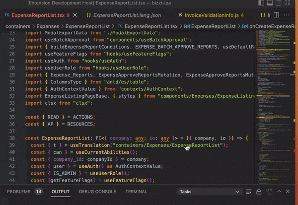

# bizzi-i18n-vscode-extension README

## Giới thiệu

**Bizzi I18n VSCode Extension** là một extension được thiết kế riêng cho các project của **Bizzi** nhằm cải thiện trải nghiệm develop liên quan đến i18n trên VSCode.

## Cài đặt

Sử dụng `bizzi-codemod` (đã được cài đặt sẵn trong repo `bizzi-ipa`)

```
$ npx bizzi-codemod vscext-install
```

## Các tính năng

### 1. Navigation

- Hỗ trợ navigate đến file json language trong `useTranslation()`
- Hỗ trợ navigate đến tận key language trong hàm `t()`



### 2. Convert nhanh một đoạn text tiếng Việt thành translation entry

Các bước thực hiện

- Trỏ chuột đến đoạn text cần thay thế (không cần select). Nhấn tổ hợp `Cmd` `Shift` `P` rồi chọn đúng đến lệnh `Bizzi I18n: Extract from selected`
- Nếu đoạn text đã có trong translation được component sử dụng, ngay lập tức đoạn text sẽ được thay thế bằng key tương ứng; nếu chưa, bạn sẽ được yêu cầu nhập key mong muốn, rồi enter là xong.


